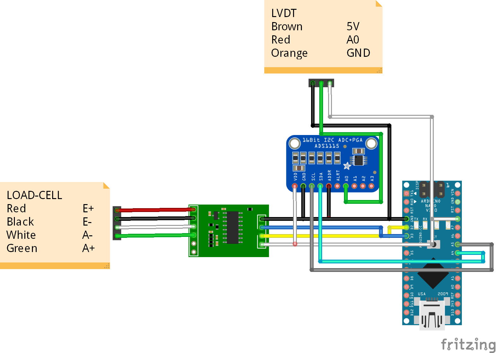
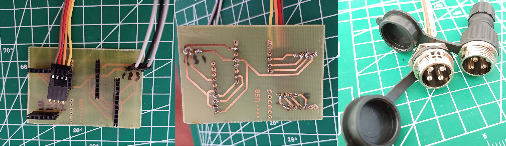

# Introduction
This project was developed to obtain load-displacement data during measurement without interfering with the actuation system of uniaxial compressive or tensile devices. 

## Externals
### Load Cell
I tested the sevice with different types of load cells (S type, beam type, canister type etc.). All of them had 4 wire connection (Red, green or blue, black, white). Interestingly, some manufacturers using 6 pin Mike connectors but only using 4 pins. These are also works well.

### LVDT
I have only used the device with one type of lvdt (Novotechnik tr-05). However, other lvdts I have examined have the same connection type. I think this system is compatible with 3-pin analog lvdts, but it would be useful to check the pin map in case of a possible part change.

# Wiring
The basic wiring diagram is as shown in the image below.

# Components
- Arduino Nano (any microcontroller works as well. But nano is very compact and cheap)
- ADS1115 (analog-digital-converter for lvdt)
- HX711 (also adc but also signal amplifier for load cell)

# Important Notes
- Non-complete version.
- SCK and DT pins are important. For some necessities, these pins were connected differently in different versions. In the first physical version, for example, these pins were cross-connected.
- In the C code, calibration values should be changed for your own configuration. Both sensors are used in project has linear measurement. So its easy to calibrate with raw values and their corresponding real values. After calibration phase is done, you should also change the calibration variable (bool) as false.
- In my experience, the hx711 is a very fragile module. I recommend you to keep plenty of spares.
- The photos show the first physical version. The circuit design I provided in the project is much better in terms of both the distance between the ports and the ease of connection. But it also takes more space than the first version.

